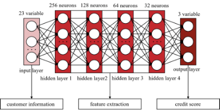

# **Optimizing Lending Strategies - Credit Default Analysis Based on Deep Learning**
## **— Recommendations for Banks on Loan Issuance and Risk Management**

9 Oct 2024
Page: 20

This is a group work I took part in. I am in charge of machine learning and optimization problems.

# **Executive Summary**
In the banking sector, the ability to efficiently assess risk and effectively extend credit is crucial for maintaining profitability while mitigating potential losses. This executive summary outlines a strategic approach to lending that incorporates advanced technological solutions to optimize risk assessment and lending decisions.
### **Part I: How to Lend - Effective Lending Strategies**
Recommendations:

1\. Prioritize borrowers with mortgages: These borrowers exhibit lower default rates due to their stable financial profiles, which are evidenced by their capacity to secure and consistently meet mortgage payments. This group represents a safer investment for the bank.

2\. Target debt consolidation loans: Individuals seeking debt consolidation loans often demonstrate better financial literacy and money management skills. By extending credit to these borrowers, the bank can expect a higher likelihood of loan repayment and lower default risks.

3\. Introduce flexible installment plans: By offering flexible repayment options, banks can enhance affordability for borrowers and simultaneously manage risk more effectively. This approach can lead to higher customer satisfaction and reduced default rates.

Reasons:

- The stability and financial responsibility associated with mortgage holders make them an attractive demographic for lending.
- Debt consolidation loans appeal to borrowers with a proactive approach to managing their finances, which correlates with a lower risk profile.
- Flexible installment plans cater to the diverse needs of borrowers, potentially increasing loan uptake and improving repayment rates.
### **Part II: How to Lend Wisely** 
Using Strong Correlation Variables: By analyzing the correlation of various variables during the model training process, banks can identify and prioritize those with the most significant impact on credit prediction. This approach can enhance the accuracy of the lending model and improve key performance metrics.
### **Part III: How Much to Lend**
Recommendations:

Maximize Net Present Value (NPV) under controllable risk of default: Banks should leverage initial credit lines to offer lower credit limits to borrowers with lower credit scores and higher limits to those with higher scores. This strategy allows for the maximization of potential returns while keeping risk within acceptable parameters.

Reasons:

- Tailoring credit limits based on creditworthiness ensures that the bank extends credit in a manner that balances risk and reward.
- By focusing on maximizing NPV, banks can ensure that their lending activities are financially sustainable and profitable in the long term.

In conclusion, by adopting a strategic approach to lending that includes prioritizing low-risk borrowers, offering flexible repayment options, and utilizing data-driven models to assess risk, banks can achieve a more efficient and effective lending process. Additionally, by leveraging technological solutions to refine risk assessment and credit extension, banks can enhance their competitive edge in the financial market.

# **Abstract**
With the increase in the total amount of bank loans and the existence of default repayment situations, our research aims to provide recommendations for banks' lending policies from multiple levels. We first put forward some overall strategic recommendations for the bank's lending. Next, we establish financial models, such as Logistic Regression Model, Random Forest, KNN, Neural Networks to predict the credit and default repayment probability of customers based on their personal and financial background information. Finally, we conducted research on the optimal lending amount based on the NPV model. In summary, our research makes contributions to the bank's credit evaluation of customers and optimization of lending policies.

# **1. Introduction**
## **1.1 Background and Context** 
Bank lending strategies are vital for financial stability, economic growth, and consumer support, balancing loan issuance with risk management. (Bessis, 2011) Based on the updated data provided by Singapore's official data portal[^1], the total licensed moneylending loan quantum from 2013 to 2021 demonstrates an overall increasing trend, with some fluctuations in 2020 and 2021. In contrast, the total amount of outstanding licensed money lending loans has steadily increased year-over-year throughout the same period.

|  |  |
| ------------------------------------------------------------------------------ | ------------------------------------------------------------------------------ |
| _Figure 1.1 Total Licensed Moneylending Loan Quantum (2013-2021)_              | _Figure 1.2 Total Outstanding Licensed Moneylending Loans (2013-2021)_         |

Banks face significant challenges in loan issuance, including assessing creditworthiness, adapting to macroeconomic shifts, and minimizing delinquency risks. The COVID-19 pandemic amplified market volatility and borrower uncertainty, underscoring the need for robust lending strategies and risk models. (Boubaker & Nguyen, 2022) Effective adaptation ensures sustainable growth and supports the stability of both the financial system and the broader economy.
## **1.2 Problem Statement** 
The core problem identified in this study revolves around the dilemma of loan approval decisions: on one hand, if the applicant is likely to repay the loan, denying the application results in a lost business opportunity for the bank. On the other hand, if the applicant is unlikely to repay the loan and defaults, approving it would lead to financial losses. Therefore, the challenge for banks is to accurately predict these scenarios to maximize revenue while minimizing risks, striking an effective balance between business growth and risk management.
## **1.3 Objectives** 
This report aims to optimize lending strategies to effectively manage risks and enhance value for both financial institutions and borrowers. It provides recommendations on lending effectively and emphasizes the use of predictive models to identify high-risk borrowers, ensuring that loan approval decisions are driven by data and insights for better risk management.
## **1.4 Scope and Structure** 
The report addresses three key aspects of lending strategies: effective practices, risk minimization through predictive models, and optimal loan amounts. The first section, "How to Lend," offers effective strategies. The second, "How to Lend Wisely," focuses on using predictive models to identify high-risk borrowers. The third explores Net Present Value (NPV) optimization to guide financially viable loan decisions.
# **2. HOW TO LEND - EFFECTIVE LENDING STRATEGIES** 
## **2.1 METHODOLOGY**
### **2.1.1 Data Sources** 
The analysis utilizes accepted loan data from LendingClub, a leading US peer-to-peer lending platform and the first to register loan offerings as securities with the SEC. (Faressayah, 2023) The dataset, spanning 2007 to 2018, offers valuable insights into borrower behavior and loan performance.
### **2.1.2 Data Preprocessing** 
The original dataset consisted of approximately 5 million records, which exceeded the processing capacity of our resources. To manage this, we performed random sampling, selecting 10% of the records for analysis.

Following the sampling process, we focused on feature selection. From the original dataset, we identified 28 relevant features, listed in appendies. Next, we extracted all numeric features into a new subset for further analysis.
### **2.1.3 Analytical Approach** 
In this "How to Lend" section, we begin by analyzing the dataset from a broad perspective, focusing on actionable insights derived from basic tests and analyses. First, we examined the distributions of key categorical variables, such as loan term, home ownership, and loan purpose, in relation to loan status, uncovering meaningful trends. We then applied a correlation matrix to evaluate the relationships between the numeric features, identifying potential patterns that could further inform lending decisions.
## **2.2 ANALYSIS AND RESULTS**
### **2.2.1 Findings from Data Analysis** 
Loan Status Distribution by Home Ownership indicates that borrowers with a mortgage have the highest loan repayment rate, with 82.48% of loans fully paid and 17.52% charged off. Renters show a lower repayment rate, with 76.84% of loans fully paid and 23.16% charged off. Borrowers who own their homes have a fully paid rate of 79.34%, with 20.66% of loans charged off. This suggests that borrowers with mortgages tend to have better loan performance compared to renters or homeowners.
![[images/Pasted image 20241218114203.png]]
_Figure 2.1 Loan Status Distribution by Home Ownership_

To focus on the purposes of loan, loans for small businesses stand out with the highest default rate at 29%, indicating a higher risk for lenders in this sector. Meanwhile, debt consolidation loans, though showing a moderate default rate of 21%, have a significantly larger demand, making them a major part of the overall loan volume. On the other hand, wedding, vacation, and home improvement loans, which are linked to discretionary spending, represent a smaller portion of the total loans. However, their default rates, ranging from 16% to 18%, are still considerable and pose some level of risk.

The correlation matrix below shows that loan amount and installment have a high correlation with a value of 0.95, indicating a strong linear relationship between these two variables in the dataset.

The chart on the right indicates that loans with higher installment amounts tend to have higher charge-off rates. The Low Installment group has the lowest charge-off rate at 15.33%, while the Medium and High Installment groups have charge-off rates of 21.58% and 22.17%, respectively. This suggests that as installment amounts increase, the risk of default also rises, making installment size an important factor in evaluating loan risk.

### **2.2.2 Interpretation** 
Considering the findings, we recommend that banks focus on approving loans with shorter terms, prioritize borrowers with mortgages, target debt consolidation purposes, and consider offering more flexible installment plans. The rationale for favoring short-term loans is straightforward, as these generally carry lower risk. Borrowers with mortgages tend to demonstrate lower default rates compared to renters or homeowners without mortgages, suggesting that banks might offer more favorable terms for this group.

Regarding debt consolidation, applicants in this category may have better financial literacy and a greater likelihood of managing their finances effectively. Therefore, loans for debt consolidation could be given a more favorable risk assessment, considering other criteria. Furthermore, introducing more flexible installment plans could attract clients and increase the overall loan amount. This observation is supported by the significant correlation between monthly installment amounts and total loan amounts, along with the finding that default rates tend to increase as installment amounts rise. Therefore, managing installment plans strategically can benefit both clients and the bank's risk management efforts.

# **3. HOW TO LEND WISELY - RISK-AWARE LENDING PRACTICES**
## **Part 1 Personal Background Information**
## **3.1 METHODOLOGY**
### **3.1.1 Objective**
We aim to explore how obtainable personal background information can assess borrowers' repayment ability, helping lending institutions in processing applications from both individuals with and without established credit histories, ultimately enabling them to make more comprehensive and informed decisions.
### **3.1.2 Dataset**
We selected the application\_train.csv file from the Home Credit Default Risk dataset on Kaggle and focused on a subset of personal background features that align with our objective of predicting repayment ability.
### **3.1.3 Exploratory Data Analysis**
**Data Overview**

From the original 121 features in the dataset, we manually selected 20 numerical and categorical features that were specific to the client’s personal background information for analysis. (Home Credit Group, 2018) The selected features and their descriptions can be found in the appendix. 

**Target Variable**

The TARGET variable indicates loan repayment outcomes: 0 signifies that the loan was repaid, while 1 indicates the loan was not repaid.

With approximately 92% of loans being repaid and only 8% not repaid. This imbalance could potentially affect model performance, as most models may tend to predict the majority class.

*Figure 3.1 Distribution of Target Variable*

**Anomalies**

In the DAYS\_EMPLOYED variable, the maximum value is 365243, indicating that the person started working about 1000 years before the application, which we consider an anomaly in the data.

![[images/{5067B4DF-1C7F-4F3D-A7D9-93AE4516DD2D}.png]]

The default rate for clients without anomalies is 8.66%, while the default rate for clients with anomalies is 5.40%. This indicates that clients with anomalies values have a lower default rate than other clients. These anomalies may represent some meaningful patterns, we do not want to completely disregard them. Therefore, we consider setting these anomalies values as missing values.

*Table 3.2 Summary of Default Rates for Employment Anomalies*

**Missing Values**

Upon the selected features, 5 of them contain missing values. 

*Table 3.3 Summary of Missing Values*

**OWN\_CAR\_AGE and FLAG\_OWN\_CAR**

*Table 3.4 Car Age by Car Ownership*

**OWN\_CAR\_AGE** and **FLAG\_OWN\_CAR** reveal a significant relationship. We observed that nearly all missing values in **OWN\_CAR\_AGE** correspond to clients who do not own a car, indicating that when clients lack a vehicle, it is reasonable to infer that their car age would logically be zero.

1. **OCCUPATION\_TYPE and DAYS\_EMPLOYED**

There are 55372 records where both **OCCUPATION\_TYPE** and **DAYS\_EMPLOYED** are missing, suggesting a strong potential correlation between the two, where the absence of occupation type likely indicates unemployment, leading to missing employment days.

*Table 3.5 Cross-Table of Missing Values*
### **3.1.4 Feature Engineering**
**Handling Missing Values**

We set the **OWN\_CAR\_AGE** to 0 for all samples without car ownership. For samples where both **DAYS\_EMPLOYED** and **OCCUPATION\_TYPE** are missing, we filled **DAYS\_EMPLOYED** with 0 and **OCCUPATION\_TYPE** with “unemployed”.

Then, we created a new feature, **na\_count**, to capture the number of missing values per sample, as we hypothesize that individuals with more missing values may be concealing important background information and want to make the missing values more valuable for analysis. 

For the remaining missing values, we replaced missing values in categorical data with the most frequent value. For numerical data with less than 5% missing values, we imputed the median to ensure robustness against outliers. For numerical data with a higher percentage of missing values, we employed the K-Nearest Neighbors (KNN) algorithm to identify and use the values from the closest neighbors for imputation.

**Feature Selection**

To minimize the impact of multicollinearity, we calculated the correlation between features and removed those with high correlations. We then used SelectKBest, based on Analysis of Variance (ANOVA), to select the features most useful for predicting the target variable by evaluating their F-scores.
### **3.1.5 Model Implementation**
To predict clients’ repayment default behavior, we construct two models: logistics regression and random forests machine learning model. The logistic regression model analyzes the relationship between late payments and clients' background characteristics by providing the coefficients and corresponding p-values for the independent variables. Random forests are an ensemble learning method that improves prediction accuracy by constructing multiple independent decision trees. It enhances model diversity through random sampling and random feature selection, thereby reducing the risk of overfitting. During prediction, random forests generate final predictions by voting or averaging the results from all the trees.

To address the class imbalance in our original sample, caused by the small proportion of late payment cases, we performed random sampling from the group without late payments to match the number of cases in the late payment group. And then we follow the standard modelling practice and divide the original sample into a training set to train the model and a test set to evaluate the performance of our model. For the evaluation of the prediction performance, we use the AUC, accuracy, sensitivity, specificity four measures and draw the corresponding ROC curve plot. The area below ROC curve reflects AUC and the y-axis and x-axis of it reflect sensitivity and specificity, respectively. Detailed definitions of those measures are listed below:

Accuracy=TP+TNTP+TN+FP+FN										  (1)

Sensitivity=TPTP+FN													          (2)

Specificity=TNTN+FP													          (3)

where TP, TN, FP, and FN represent the true positives, true negatives, false positives, and false negatives, respectively.

After dividing sample, building prediction models and comparing the performance, we further investigate the differences of importance of background characteristics on predicting clients’ repayment default behavior based on both mean decrease in accuracy (MDA) and mean decrease in gini (MDG). MDA assesses feature importance by measuring the contribution of features to model predictions, while MDG measures the average contribution of features to reducing impurity across all trees. Overall, our whole research flow is shown in the figure below.

*Figure 3.3 Flow charts for model training and prediction*
## **3.2 ANALYSIS AND RESULTS**
### **3.2.1 Prediction of Late Payment**  
To evaluate prediction performance of different models, we randomly selected 70% of the samples as the training set and used the remaining 30% as the test set. According to the figure, the AUC value for logistic regression is 0.708, which is more favorable compared to 0.700 for random forest. Looking at the accuracy, sensitivity, and specificity of both models, we can also see that the predictive performance of logistic regression is better than that of the random forest model. Therefore, for predicting loan defaults, the overall performance of the logistic regression model is higher than that of the random forest model.

*Figure 3.4 Model comparison: prediction performance of different models*
### **3.2.2 Importance of Background Characteristics Variables on Predicting Late Payment**
According to the figure, regardless of which metric is used, the borrower's external credit score and age are the two most important background features for predicting with the random forest model. However, there are differences: based on MDA, the borrower's education level, gender, and years of employment rank as the third, fourth, and fifth most significant contributors to the model's prediction accuracy, respectively. In contrast, based on MDG, the borrower's years of employment, population of the residence area, and income rank as the third, fourth, and fifth background features that contribute most to the model's predictions.

*Figure 3.5 Importance of background characteristics in modelling*

## **Part 2 Financial Background Information** 
## **3.3 METHODOLOGY**
Our study's dataset predicts credit scores from 28 features across 150,000 records, covering demographics, financial behavior, and credit history. It includes demographic details like age (with errors like negative values), occupation, and income, alongside financial behavior indicators such as salary, debt, and credit use, with some missing data. Credit history features are key, and the target 'Credit\_Score' is divided into "Good," "Average," and "Poor" categories.
### **3.3.1 Data Preprocessing**
The data for this project was found on Kaggle. Since real data was used in this project, there are many problems with this set of data and the data needs to be cleaned. 

Step 1: Removed incorrect symbols (e.g., "-", "\_") from the dataset.

Step 2: Corrected wrongly registered data, such as converting years and months properly.

Step 3: Replaced special symbols with more understandable terms.

Step 4: Handled missing values by replacing them with mean or median values, depending on the data type.

Step 5: Converted data types where necessary (e.g., strings, numbers into categories).

Step 6: Removed irrelevant variables (e.g., ID, name) to avoid them affecting model accuracy.

Based on the ratio of 8:2, the data is divided into training set and test set. The model is fitted and analyzed by means of supervised learning.
### **3.3.2 Random Forest**
Since this project involves predictive analysis of "Credit Score," we observed that the data for this variable consists of three categories: "Good," "Standard," and "Poor." Because these are categorical data, we initially considered using logistic regression, a classification model, during the model selection process. However, training results showed that the model could not effectively distinguish between the three categories, so we considered using a more complex model.

Next, we chose to use a decision tree model. But since a single decision tree is prone to overfitting, the results were still inadequate in correctly classifying the three categories. Therefore, we considered using a Random Forest model. The core idea of Random Forest is to reduce the overfitting risk of individual decision trees through randomness, thereby enhancing the model's generalization ability. Compared to a single decision tree, the Random Forest model is less likely to overfit, handles outliers better, and is suitable for classification problems. Therefore, we decided to try the Random Forest model.

*Figure 3.6 Schematic diagram of random forest model*

During model training, we used the default hyperparameters with a random state of 66. The model uses K-fold cross-validation to determine the best model. First, the dataset is divided into 5 parts, and in each iteration, 4 parts are used for training, while the remaining one part is used for testing. This process is repeated 5 times, with a different group used as the test set each time. Finally, the average of the 5 results is taken as the final evaluation of the model. The model will use the number of trees ranging from 50 to 200 and the depth from 0 to 30 to select the best model. Through K-fold cross-validation, the best model was found when the number of trees was 175 and the depth was 0, where the model was able to achieve the best prediction results. The model achieved an accuracy of 81% on the designated test set. Further evaluation showed a precision of 81%, a recall of 80%, and an F1-score of 81%. The model was most accurate in predicting the "Standard" category, achieving an accuracy of 83%. Analysis of each splitting node revealed that “Outstanding Debt”, “Interest Rate”, and “Credit Mix” were the features that had the most significant impact on the model's predictive ability. These three features provided the greatest gain to the model.

*Figure 3.7 Feature Importance in Random Forest*
### **3.3.3 Deep Learning** 
1. #### ***Data Standardization and Class Weights***
- **Data Standardization:** Standardization is crucial for neural network training as it normalizes feature scales to prevent bias towards high-valued features. It helps in faster model convergence, improves training stability, and reduces the risk of gradient issues.
- **Class Weights:** The credit score prediction model faces class imbalance, where "Good" scores are more common than "Poor" ones. To address this, we applied class weights, giving more weight to less frequent classes. This helps the model focus on minority classes, improving their prediction accuracy and achieving a more balanced performance. The “Smote Method” is applied.
2. #### ***Deep Learning Model Architecture***
We employed a multi-layer neural network architecture to handle the task of predicting credit scores. This design leverages several layers of neurons to extract complex features and nonlinear relationships from the data.
- **Fully Connected Layers (Dense Layers):** The model consists of dense layers with decreasing neuron counts (256, 128, 64, 32), each using the ReLU activation function to handle non-linearity and reduce vanishing gradients. This architecture allows the model to capture broad patterns in early layers and refine them in deeper layers, improving generalization.
- **Output Layer and Softmax:** For the three-class credit score classification, the output layer has three neurons with Softmax activation, converting outputs into probabilities for each class, making predictions clear and interpretable.

*Figure 3.8 Feedforward Neural Network Diagram* 
2. #### ***Model Optimization and Regularization***
To boost performance and avoid overfitting, we used batch normalization after each hidden layer to stabilize learning and allow higher learning rates, and Dropout with rates of 40% and 30% after fully connected layers to enhance generalization. These techniques help the model perform well on both training and test data.

2. ***Loss Function and Training Strategy***

We used sparse\_categorical\_crossentropy as the loss function for efficient multi-class classification with integer labels and the Adam optimizer for its adaptive learning rate, which is effective for complex models. To avoid overfitting, we employed early stopping when validation loss plateaus for 10 epochs, ensuring efficient training and generalization.

2. ***Model Evaluation*** 

The evaluation results of the model show that the loss function in the training process gradually converges, and the loss values of the verification set and the training set change similarly. The minimum loss value of the final verification set is 0.60, and the minimum loss value of the training set is 0.64, indicating that there is no obvious overfitting of the model in the training process. In terms of accuracy, the accuracy of the training set and the verification set gradually increased and became stable. The highest accuracy of the training set was 0.75, while the highest accuracy of the verification set was 0.74, indicating that the model had good generalization ability.

|         *Figure 3.9 Loss Convergence Diagram*         |        *Figure 3.10 Accuracy Diagram*        |
| :------------------------------------------------------------------------------------------------------------------------: | :---------------------------------------------------------------------------------------------------------------: |
| 

**  *Figure 3.11 Classification Report*
 | 

*Figure 3.12 Confusion Matrix*
 |

The confusion matrix further shows the model's performance in three categories, where class 0 and Class 1 have a high recall rate, while class 2 has a relatively low recall rate of about 0.60, indicating that the model still has room for improvement in recognizing class 2. Overall, the accuracy rate of the model is 0.75, the accuracy rate and the recall rate are relatively balanced, and the performance is relatively stable.
### **3.3.4 KNN** 
Since this project aims to predict categorical data, the KNN (K-Nearest Neighbors) model is also a suitable choice to meet the project's requirements. The basic idea of KNN is for a given input sample, find the K-Nearest neighbors in the training set, and then predict the category of the input sample based on the categories of these neighbors. In this project, Euclidean distance is used to determine the similarity between samples.

Standardized data ensures that differences in numerical values do not affect the model's accuracy. The model uses K=5, which means the classification decision for a new sample is determined based on the majority category among its five nearest neighbors. The model's performance on the designated test set achieved an accuracy of 74%. Further evaluation showed a precision of 74%, a recall of 74%, and an F1-score of 74%. The model was most accurate in predicting the "Standard" category, achieving an accuracy of 74%.
### **3.3.5 Other Models**
In this project, we also experimented with several other models, but due to reasons like low accuracy, these models were filtered out. Below is a summary:

- **Logistic Regression Model**: This model was unable to accurately distinguish among the three categories, resulting in very low accuracy.
- **Decision Tree Model**: This model encountered overfitting issues during training, leading to very low accuracy on the training set.
- **GBDT Model (Gradient Boosting Decision Tree)**: This model was used to address the overfitting problem of the decision tree model. It gradually improves the model's predictive ability by constructing multiple decision trees. GBDT is a boosting method where each new decision tree is trained based on the errors of all previous decision trees to minimize the loss function. Compared to the decision tree model, this model showed a significant improvement in accuracy, ultimately reaching **72%**. However, since the accuracy was still relatively low compared to other models, this model was filtered out.
- **SVM Model (Support Vector Machine)**: This model was used to solve the issue where the logistic regression model was too simple to distinguish among the three categories. It is a supervised learning algorithm used for classification and regression, which achieves classification by finding a hyperplane in a high-dimensional space to separate the data. Compared to the logistic regression model, this model is more complex. While it successfully classified the three categories, the accuracy was still too low, only **68%**.
# **4. HOW MUCH TO LEND - DETERMINING OPTIMAL LOAN AMOUNTS**
## **4.1 Research on NPV optimization**
Building upon the prediction of default probability, the study of optimization of Net Present Value (NPV) is taking a step forward to offer insights and solutions to the pivotal question of "how much to lend." This study draws upon the seminal work of Haimowitz et al. (Haimowitz & Schwarz, 1997), which employs a framework of clustering and prediction to optimize the NPV of credit lines. Our group recounts the similar method and aims to extend beyond the probability of credit default to investigate the optimal lines of credit for individual clients.

Our study will draw attention to solving the following problems:

- High-Risk Customer Identification
- Credit Limit Allocation
- Balancing Profit and Risk
## **4.2 Analysis Preparation**
### **4.2.1 Definition: Understanding NPV**
In the context of banking and lending operations, Net Present Value (NPV) is a critical financial metric that represents the difference between the present value of cash inflows and the present value of cash outflows over a period of time. It is a simple yet powerful tool for evaluating the profitability of investments or projects. In the banking sector, NPV can be succinctly defined as the continuous net cash flow value, discounted for the present, minus the losses incurred due to defaults.
### **4.2.2 The Formula of NPV**
The formula for calculating NPV is as follows:

` `

To fully comprehend the NPV formula, it is essential to dissect it into its constituent components, specifically the elements on either side of the subtraction operator.

- **Left Side of the Subtraction – Revenue**: The left side of the formula pertains to the revenue generated from the loan. The term  11+i  represents the discount factor for each period, where i  is the discount rate. Assuming an analysis is conducted for a one-year credit period with the loan maturing in one year and being repaid in 12 equal installments, the cash flow for each period (denoted as CF)  Can be calculated based on the loan amount. The bank's revenue is the sum of the discounted cash flows, with n being set to 12 periods and t incrementing from 1 to 12.
- **Right Side of the Subtraction – Costs**: On the right side of the formula, we account for the costs associated with the lending process. For simplicity, we assume that the primary cost is the loss due to loan defaults, known as Expected Credit Loss (ECL). According to the IFRS 9 (International Accounting Standards Board, 2014), ECL can be calculated using a straightforward method, which is the product of the Exposure At Default (EAD) and the probability of default (denoted as p) Through regression models or more sophisticated machine learning models, an attempt is made to establish a mapping relationship from the loan amount x to EAD and the probability of default.
### **4.2.3 Theoretical Foundation**
There’s a positive correlation between the credit limit and both the bank’s revenue (discounted cash flows) and the probability of default (risk exposure). Higher credit limits increase interest income but also raise default risk, making it crucial to find a balance that maximizes NPV while controlling credit risk.
## **4.3 Model Building and Results**
The analysis is conducted through the following steps:

**Step 1: Linear Model**

Constructing a functional model using the available data. This model establishes a mapping from the credit limit x  to the default risk exposure (EAD) and the probability of default. While more complex and accurate empirical models exist in industry analyses, this study, due to limitations in data acquisition and analytical methods, employs a simple linear regression model to simulate the resolution of the optimization problem.

**Step 2: Optimization Solution**

The third step involves the application of the Sequential Least Squares Programming (SLSQP) method from the scipy package. This algorithm is designed to solve constrained nonlinear optimization problems. For each user with given information, the model can predict the optimal loan amount and the maximum NPV achieved at this amount.

**Step 3: Visual Analysis of Users**

The final step involves visual analysis based on different user information. Various credit limits can be plotted against the NPV curve for a given user. High-credit users show a decline in the NPV curve only after a significantly high credit limit, whereas users with poor credit see a rapid decline in the curve even at a minimal credit limit, indicating a high expected default cost.

 	

*Figure 4.1 NPV under Different Amount of Lines of Credit (LoC)*
# **5. Recommendations (Executive Summary)**

| **Recommendations**                                                                    | **Reasons**                                                                                                                                                                                                                                                                                                                           |
| :------------------------------------------------------------------------------------- | :------------------------------------------------------------------------------------------------------------------------------------------------------------------------------------------------------------------------------------------------------------------------------------------------------------------------------------ |
| **Part I: How to Lend - Effective Lending Strategies**                                 |                                                                                                                                                                                                                                                                                                                                       |
| Prioritize borrowers with mortgages                                                    | Borrowers with mortgages tend to have lower default rates due to their stable financial profile, demonstrated by their ability to secure and maintain mortgage payments.                                                                                                                                                              |
| Target debt consolidation loans                                                        | Debt consolidation borrowers often have better financial literacy and money management skills.                                                                                                                                                                                                                                        |
| Introduce flexible installment plans                                                   | Flexible plans improve affordability and risk management.                                                                                                                                                                                                                                                                             |
| **Part II: How to Lend Wisely**                                                        |                                                                                                                                                                                                                                                                                                                                       |
| Utilize clients’ personal background information to predict repayment default behavior | According to the importance of each personal background characteristic, external credit score, age, length of employment are the most influential factors and should be given greater consideration to make prediction.                                                                                                               |
| Use the strong correlation variable to fit model                                       | During the training process of the model, the importance of variables was obtained. Therefore, in future attempts, banks can filter out some unimportant variables, ensuring that the variables used for credit prediction are those that have a strong impact on the model. This may improve the model's accuracy and other metrics. |
| Select appropriate model to improve prediction accuracy                                | When predicting clients' late payment probability, we need to choose the model that best suits our needs, focusing on overall performance rather than specific algorithms.                                                                                                                                                            |
| **Part III: How Much to Lend**                                                         |                                                                                                                                                                                                                                                                                                                                       |
| Aim at maximizing the NPV under controllable risk of default                           | Leveraging the initial lines of credit, we can quantify a lower LoC for low-credit customers and higher LoC for high-credit customer                                                                                                                                                                                                  |

# **6. Conclusion**
In our study, we evaluated several models for predicting loan default behavior and found that machine learning models, especially the random forest model, outperformed traditional logistic regression. After optimizing the number of trees and depth, the random forest model achieved an 81% accuracy rate, with "outstanding debt," "interest rate," and "credit mix" being the most significant predictors. The KNN model and a deep learning model also showed good performance with accuracies of 74% and 75%, respectively. The random forest model excelled due to its high accuracy and ability to prevent overfitting, making it our top choice for predicting loan defaults.

To optimize loan amounts, we used a simple linear regression to link credit limits to default risk and then applied the SLSQP method to solve for the loan amount that maximizes NPV while managing risk. This approach successfully determined the optimal credit limit for individual users. Looking ahead, we plan to refine our NPV prediction model by incorporating behavioral patterns and family background data, which could offer a more nuanced understanding of borrower behavior and further enhance the accuracy of our NPV forecasts.

# **References**
Bessis, J. (2011). Risk management in banking. John Wiley & Sons.

Boubaker, S., & Nguyen, D. K. (2022). Financial transformations beyond the COVID-19 health crisis. World Scientific.

Credit score classification. (2022, June 22). Kaggle. https://www.kaggle.com/datasets/parisrohan/credit-score-classification

Faressayah. (2023, January 31).  Lending Club Loan Defaulters prediction. Kaggle. <https://www.kaggle.com/code/faressayah/lending-club-loan-defaulters-prediction/notebook>

Haimowitz, I. J., & Schwarz, H. (1997). Clustering and Prediction for Credit Line Optimization. In AAAI Technical Report WS-97-07. AAAI.

Home Credit Group. (2018, May 18).  Home Credit Default Risk. Kaggle. https://www.kaggle.com/competitions/home-credit-default-risk/overview

International Accounting Standards Board. (2014). International Financial Reporting Standard 9: Financial Instruments. Retrieved from <https://www.ifrs.org/issued-standards/list-of-standards/ifrs-9-financial-instruments/>

# **Appendices**
Loan Status Distribution by Loan Term shows that 83.96% of loans with a 36-month term were fully paid, while only 16.04% were charged off. In contrast, for 60-month loans, 67.21% were fully paid, and 32.79% were charged off. This indicates that shorter-term loans have a higher likelihood of being fully repaid, whereas longer-term loans carry a greater risk of default.

*Selected Features Descriptions of Part I Dataset*

[^1]: Singapore's official data portal: https://data.gov.sg/ 
